# EZ Shop - MERN Stack Ecommerce Application

EZ Shop is a full-stack web application built using the MERN (MongoDB, Express.js, React.js, Node.js) stack. It serves as an ecommerce platform, allowing users to browse products, add them to the cart, and place orders. The application provides a seamless and intuitive shopping experience.

## Features

- User able to login and signup.
- Browse through a variety of product categories.
- Add products to the cart.
- Adjust the quantity of items in the cart (increase or decrease).
- Users can enter their address details for order delivery.
- Make dummy payment with cash or card.

## Tech Stack

**Client:** React, TailwindCSS, MUI, React useContext

**Server:** Node, Express, Axios

**Database:** MongoDB

**API:** Fakestore API

## Deployment

Visit the live deployment at [EZ Shop on Render](https://ez-shop.onrender.com/).

## Screenshots

## Home Page

  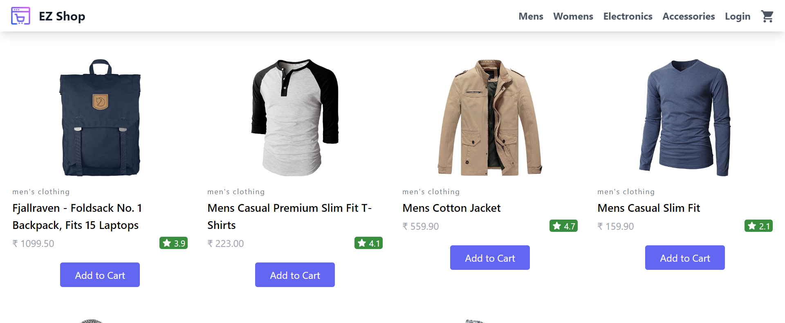  
    &ensp; &ensp;

  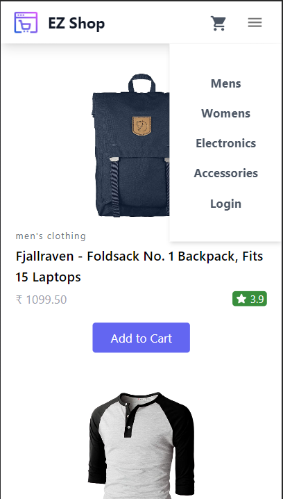  
    &ensp; &ensp;

  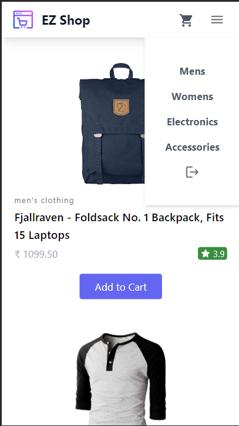  
    &ensp; &ensp;

## login Page

  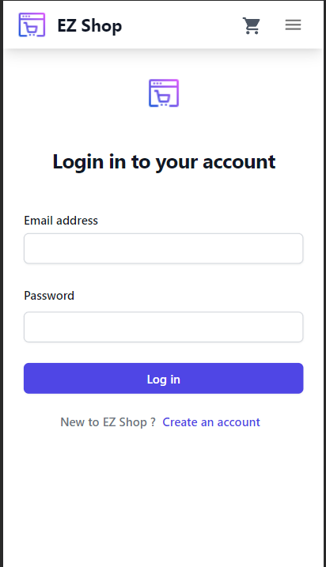  
    &ensp; &ensp;

## Signup Page

  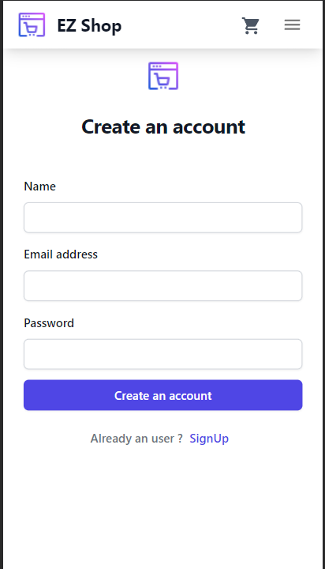  
    &ensp; &ensp;

  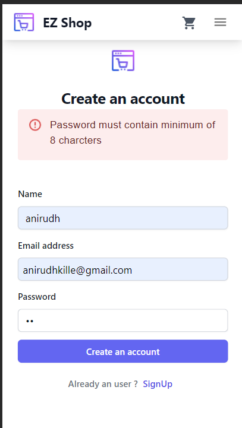  
    &ensp; &ensp;

  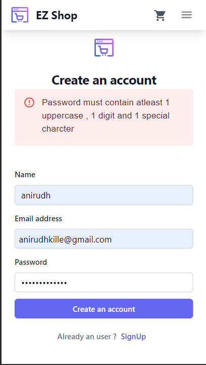  
    &ensp; &ensp;

## Cart Page

  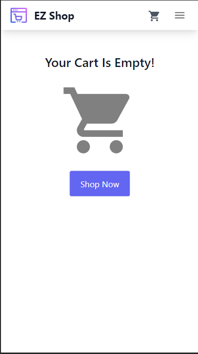  
    &ensp; &ensp;

  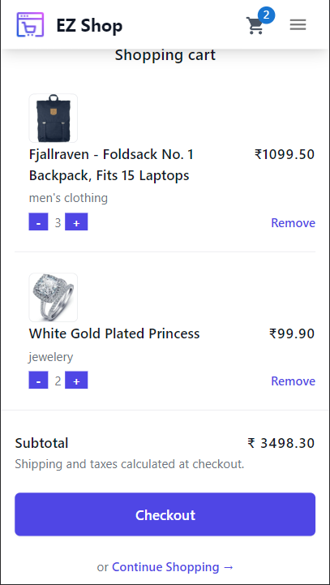  
    &ensp; &ensp;

## Checkout Page

  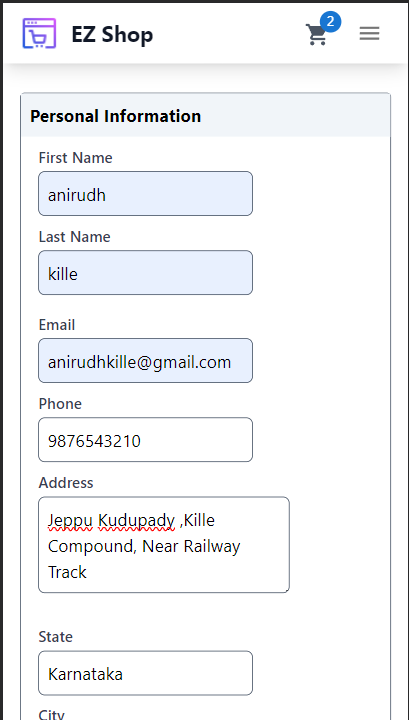  
    &ensp; &ensp;

  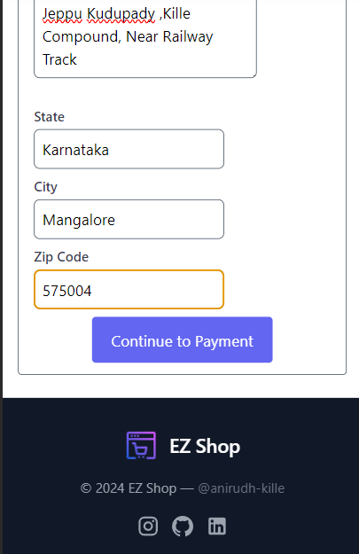  
    &ensp; &ensp;

## Payment Page

  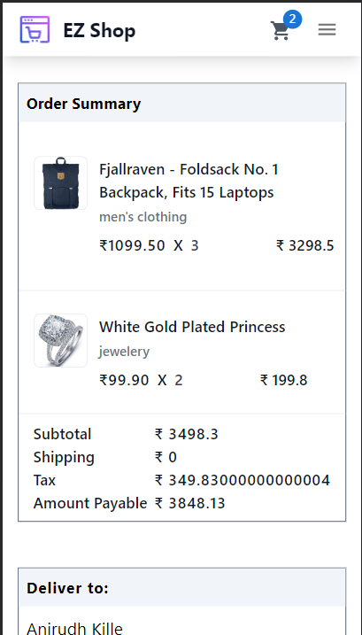  
    &ensp; &ensp;

  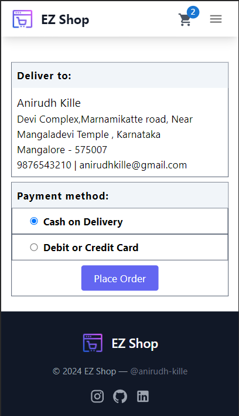  
    &ensp; &ensp;

  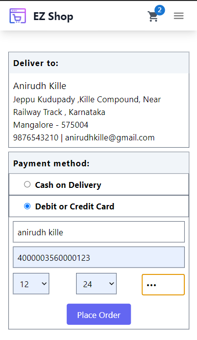  
    &ensp; &ensp;

## Order Sucessful Page

  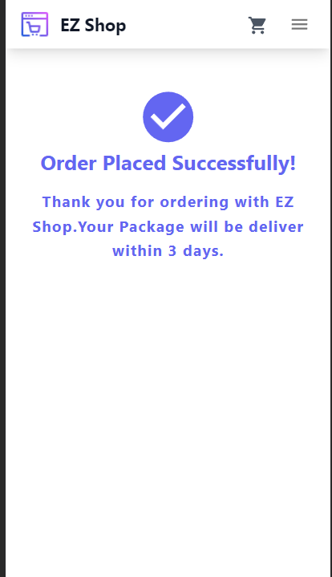  
    &ensp; &ensp;

